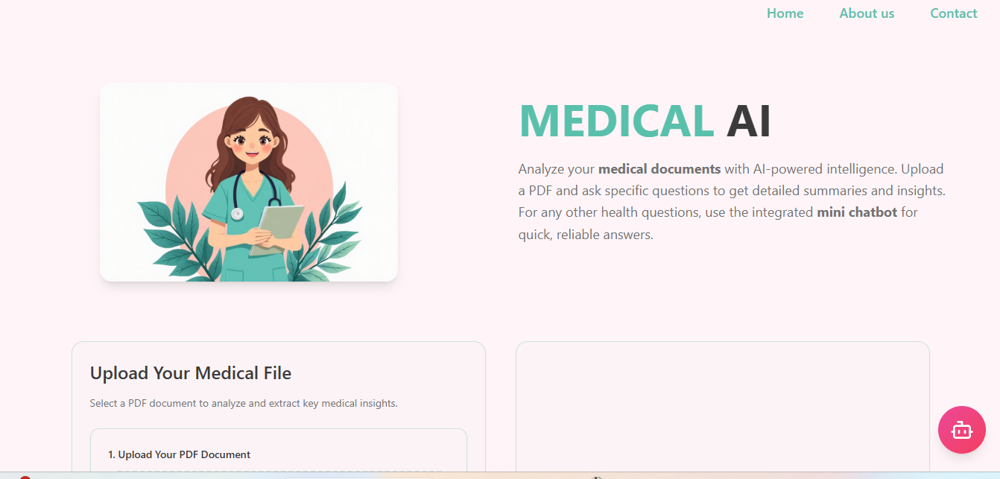
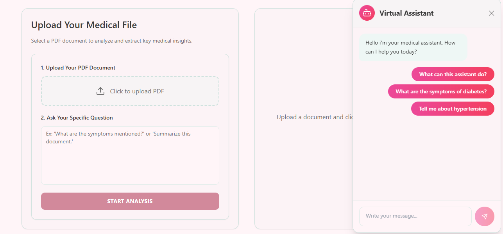
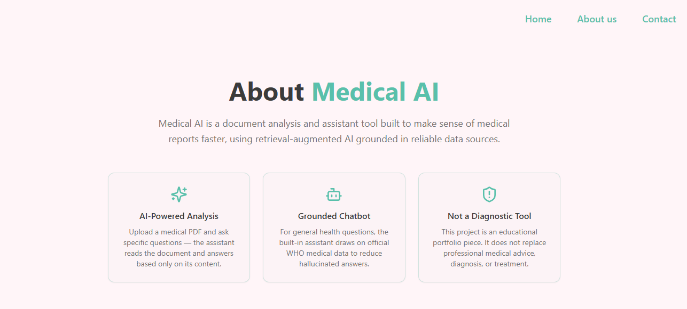
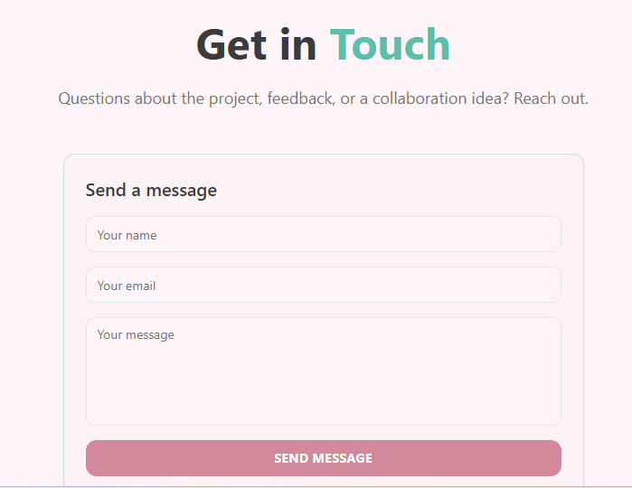
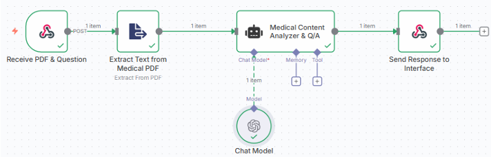
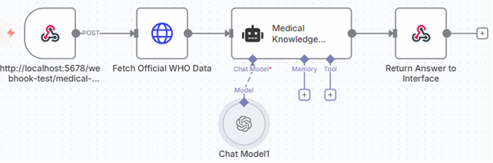

# Medical-Diagnostics-AI

An AI-powered web application for medical document analysis. Upload a PDF medical report and ask specific questions about it, or chat with an integrated assistant grounded in international medical sources (WHO) for general health questions.


## Overview

The application has two main features, running side by side:

1. **Document analysis** — upload a PDF medical file and ask a specific question about it (e.g. "What are the symptoms mentioned?"). The file is sent to an n8n workflow that extracts the text, analyzes it with an LLM, and returns a tailored answer. The result can be downloaded as a PDF summary.
2. **Medical assistant chatbot** — a floating chat widget for general medical questions, answered by an LLM connected to official WHO (World Health Organization) data through a separate n8n workflow.

The application follows a frontend/backend architecture.
The React frontend handles the user interface, while n8n acts as the backend orchestration layer, coordinating PDF processing, LLM interactions and HTTP webhooks.

# Screenshots
## Application Interface

### Home pages 




### About page


### Contact page



## Architecture

```
┌─────────────────────────┐
│   React App (Vite)      │
│                          │
│  ┌────────────────────┐  │      POST /webhook/medical-summary
│  │ FileUploadSection  │──┼────────────────────────────────►  n8n workflow #1
│  └────────────────────┘  │                                   (PDF → LLM analysis)
│                          │
│  ┌────────────────────┐  │      POST /webhook/medical-questions
│  │  ChatbotSection    │──┼────────────────────────────────►  n8n workflow #2
│  └────────────────────┘  │                                   (Chat → LLM + WHO data)
└─────────────────────────┘
```

# n8n Workflows

The backend logic is orchestrated using two independent n8n workflows running locally.

### Workflow 1 — Medical Document Analysis

This workflow receives the uploaded PDF from the React application through a Webhook node. It then:

- extracts the document content,
- sends the extracted text together with the user's question to an LLM,
- returns a structured answer to the frontend,
- allows the generated summary to be downloaded as a PDF.



---

### Workflow 2 — Medical Assistant Chatbot

This workflow powers the chatbot embedded in the application.

It:

- receives the user's question,
- queries official WHO medical resources,
- generates a grounded response using an LLM,
- returns the answer back to the React interface.



These workflows were designed and implemented in n8n to orchestrate the backend logic of the application. They handle document processing, LLM interactions, and communication with the React frontend through HTTP webhooks.


## Tech Stack

| Layer        | Technology                                  |
|--------------|----------------------------------------------|
| Frontend     | React 18, TypeScript, Vite                   |
| UI           | shadcn/ui, Tailwind CSS, lucide-react icons   |
| Routing      | react-router-dom                             |
| Notifications| sonner (toast)                               |
| PDF export   | jsPDF (client-side)                          |
| Automation   | n8n (self-hosted, local)                     |
| AI / LLM     | OpenAI GPT-4o                              |

## Features

- Upload medical PDF reports for AI-assisted analysis
- Ask questions about uploaded medical documents
- Generate downloadable PDF summaries
- AI medical chatbot connected to WHO knowledge
- Automated backend powered by n8n workflows
- Responsive React user interface
  
## Skills Demonstrated

- React & TypeScript
- n8n Workflow Automation
- REST API Integration
- LLM Integration
- Prompt Engineering
- PDF Processing
- Frontend Development
- AI-powered Applications
  
## Project Structure

```
medical-diagnostics-ai/
├── public/
│   └── favicon.ico
├── src/
│   ├── assets/
│   │   └── medical-hero.png
│   ├── components/
│   │   ├── ui/                     # shadcn/ui components
│   │   ├── FileUploadSection.tsx   # PDF upload + question form
│   │   ├── ChatbotSection.tsx      # Floating chat widget
│   │   ├── ResultDisplay.tsx       # Renders the analysis result
│   │   └── Navigation.tsx          # Nav bar (routes not yet implemented)
│   ├── hooks/
│   │   ├── use-mobile.tsx
│   │   └── use-toast.ts
│   ├── lib/
│   │   └── utils.ts                # cn() className helper
│   ├── pages/
│   │   ├── Index.tsx                # Main page (upload + chat)
│   │   └── NotFound.tsx             # 404 page
│   ├── App.tsx                      # Router + global providers
│   ├── App.css
│   ├── index.css                    # Design tokens (HSL color system)
│   ├── main.tsx                     # Entry point
│   └── vite-env.d.ts
├── .env.example
├── .gitignore
├── components.json                  # shadcn/ui config
├── eslint.config.js
├── index.html
├── package.json
├── postcss.config.js
├── tailwind.config.ts
├── tsconfig.json
├── tsconfig.app.json
├── tsconfig.node.json
├── vite.config.ts
└── README.md
```

## Prerequisites

- Node.js 18+ and npm
- [n8n](https://docs.n8n.io/) running locally (`npx n8n` ), with two workflows active:
  - a webhook at `/webhook/medical-summary` that accepts a PDF (`multipart/form-data`) and a question, and returns `{ output: string }`
  - a webhook at `/webhook/medical-questions` that accepts `{ question: string }` and returns a similar response, backed by a knowledge base of WHO medical data

## Installation

```bash
# Clone the repository
git clone https://github.com/<your-username>/Medical-Diagnostics-AI.git
cd Medical-Diagnostics-AI

# Install dependencies
npm install

# Configure environment variables
cp .env.example .env
# edit .env if your n8n instance runs on a different host/port
```

## Running locally

```bash
# 1. Start n8n and make sure both workflows are Active
n8n start

# 2. Start the React dev server
npm run dev
```

The app runs on `http://localhost:8080` (or the port Vite assigns) and expects n8n on `http://localhost:5678` by default.

## Environment Variables

| Variable                 | Description                                   | Default                              |
|---------------------------|------------------------------------------------|----------------------------------------|
| `VITE_N8N_BASE_URL`       | Base URL of the local n8n instance             | `http://localhost:5678`              |
| `VITE_N8N_UPLOAD_PATH`    | Webhook path for PDF analysis                  | `/webhook/medical-summary`           |
| `VITE_N8N_CHAT_PATH`      | Webhook path for the chatbot                   | `/webhook/medical-questions`         |


## License

MIT — see [LICENSE](LICENSE) for details.

